# Machine Learning Analysis using K-Nearest Neighbors and K-Means

**Course:** Computational Science  
**Members:** Felix Joseph Dinopol, Christian Jay Lucañas, John Kierve Gardonia  

---

## Abstract

This project presents a comprehensive implementation of machine learning techniques using both a custom dataset and a real-world dataset. Two primary algorithms are explored: K-Nearest Neighbors (KNN) for classification and K-Means Clustering for unsupervised grouping.

The study is divided into three major parts. The first part applies KNN to classify player roles based on performance metrics. The second part applies K-Means clustering to discover natural groupings within the same dataset. The third part extends the analysis using a real-world diabetes dataset, incorporating preprocessing, manual computation, and model evaluation.

---

## 1. Introduction

Machine learning provides computational methods for analyzing patterns in data and making informed predictions. Among the most fundamental algorithms are K-Nearest Neighbors (KNN) and K-Means Clustering.

KNN is a supervised learning algorithm that classifies new data points based on similarity to labeled data. In contrast, K-Means is an unsupervised learning algorithm that groups data points into clusters without prior labels.

This report demonstrates both approaches using a custom dataset and extends the analysis to a real-world medical dataset to highlight practical applications and challenges.

---

## 2. Dataset Overview

### 2.1 Player Performance Dataset

| ADR | Headshot_Percentage | Role |
| --- | ------------------- | ---- |
| 95  | 65                  | 1    |
| 88  | 60                  | 1    |
| 102 | 68                  | 1    |
| 90  | 62                  | 1    |
| 85  | 55                  | 1    |
| 60  | 30                  | 0    |
| 65  | 35                  | 0    |
| 55  | 25                  | 0    |
| 70  | 40                  | 0    |
| 58  | 28                  | 0    |

### Feature Description

* ADR: Average Damage per Round
* Headshot Percentage: Accuracy
* Role:

  * 1 = Aggressive Player
  * 0 = Passive Player

The dataset is intentionally balanced to avoid bias during classification.

---

# PART I — K-NEAREST NEIGHBORS (KNN)

## 3. Objective

The objective is to classify a new player based on similarity to existing players using the KNN algorithm.

---

## 4. Methodology

### 4.1 Distance Metric

KNN relies on Euclidean distance:

```id="eq_knn"
d = √((x₂ - x₁)² + (y₂ - y₁)²)
```

Where:

* x represents ADR
* y represents Headshot Percentage

---

## 5. New Data Point

| ADR | Headshot_Percentage | Role    |
| --- | ------------------- | ------- |
| 92  | 64                  | Unknown |

---

## 6. Distance Computation (Full Process)

Distances were calculated between the new player and all dataset entries.

### Example Computation

```id="eq_knn_ex"
d = √((92 - 95)² + (64 - 65)²)
  = √(9 + 1)
  = √10
  = 3.16
```

### Full Distance Table

| Player   | Role | Distance |
| -------- | ---- | -------- |
| (90,62)  | 1    | 2.83     |
| (95,65)  | 1    | 3.16     |
| (88,60)  | 1    | 5.66     |
| (102,68) | 1    | 10.77    |
| (85,55)  | 1    | 11.40    |
| (70,40)  | 0    | 33.94    |
| (65,35)  | 0    | 40.31    |
| (60,30)  | 0    | 47.43    |
| (58,28)  | 0    | 48.17    |
| (55,25)  | 0    | 53.04    |

Each computation reinforces how distance reflects similarity between players.

---

## 7. Sorting and Neighbor Selection

Distances are sorted in ascending order. The closest points are:

| Rank | Player  | Role | Distance |
| ---- | ------- | ---- | -------- |
| 1    | (90,62) | 1    | 2.83     |
| 2    | (95,65) | 1    | 3.16     |
| 3    | (88,60) | 1    | 5.66     |

---

## 8. K Selection and Voting

We select:

```id="k_value"
K = 3
```

### Voting Results

| Role | Count |
| ---- | ----- |
| 1    | 3     |
| 0    | 0     |

---

## 9. Classification Result

```id="knn_result"
Predicted Role = 1 (Aggressive)
```

The classification is highly reliable due to unanimous agreement among nearest neighbors.

---

## 10. Visualization and Interpretation

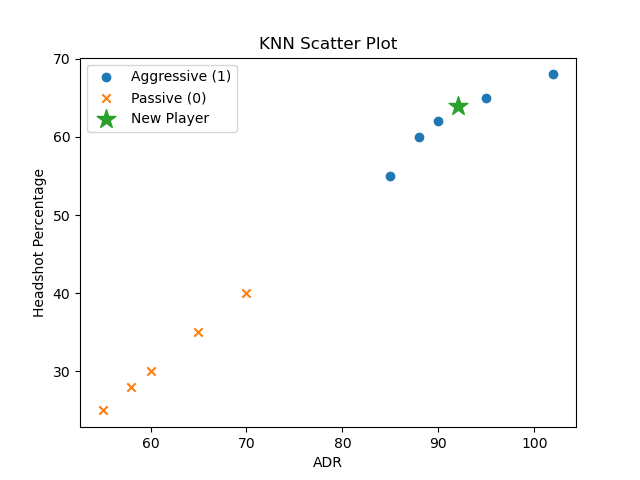

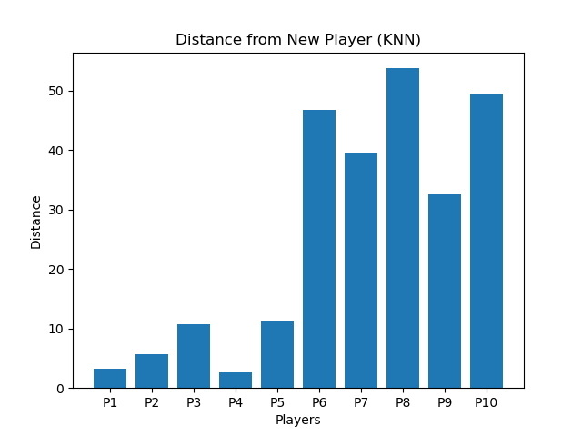

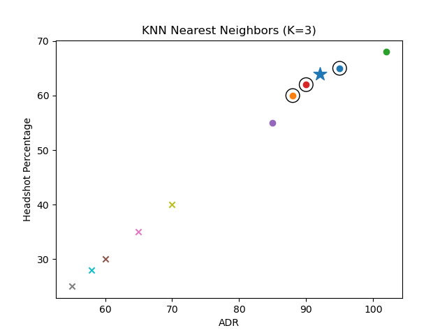

The visualizations confirm that the new player lies within a dense region of aggressive players.

---

## 11. Observations

* KNN effectively captures local similarity
* Balanced dataset improves reliability
* Distance-based logic is intuitive and interpretable
* Model performance depends on value of K

---

# PART II — K-MEANS CLUSTERING

## 12. Objective

To group players into clusters based on similarity without using labels.

---

## 13. Methodology

### 13.1 Data Representation

Each player is treated as a coordinate:

```id="point_rep"
P = (ADR, Headshot%)
```

---

### 13.2 Initialization

```id="kmeans_k"
K = 2
```

Initial centroids:

* C₁ = (95, 65)
* C₂ = (60, 30)

---

## 14. Distance Computation and Assignment

Each point is assigned to the nearest centroid.

Example:

```id="assign_ex"
Point (88,60):
d₁ = 8.60
d₂ = 41.23
→ Assigned to Cluster 1
```

---

## 15. Centroid Recalculation

```id="centroid_formula"
C = (mean x, mean y)
```

New centroids:

| Cluster   | Centroid     |
| --------- | ------------ |
| Cluster 1 | (92, 62)     |
| Cluster 2 | (61.6, 31.6) |

---

## 16. Iteration Process

Steps repeated:

1. Assign clusters
2. Recalculate centroids

Convergence occurs when no changes are observed.

---

## 17. Visualization

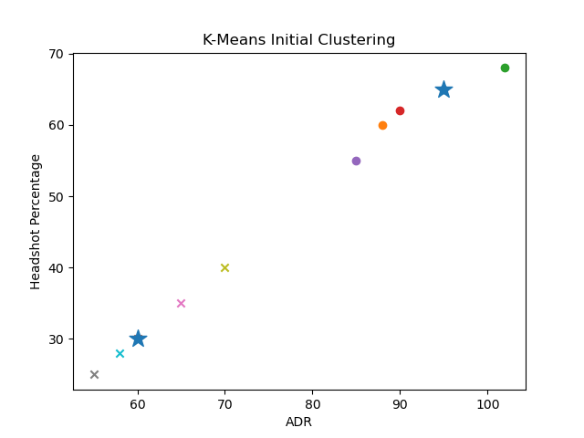

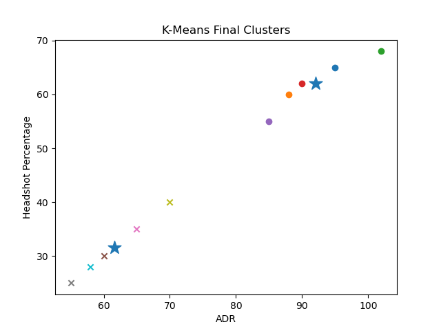

---

## 18. Observations

* Clear separation of high and low performance players
* Cluster centroids represent average performance
* Results depend on initialization
* Algorithm is efficient for pattern discovery

---

# K-Nearest Neighbors (KNN) on Diabetes Dataset

## Objective Overview
This project is all about applying the K-Nearest Neighbors (KNN) algorithm to predict diabetes outcomes using clinical metrics. We went through the whole process: exploring the data, cleaning it up (preprocessing), doing some manual math to see how the algorithm actually works under the hood, and finally evaluating the model. As a bonus, we also threw in a Logistic Regression model just to see how KNN stacks up against it.

## Part 1: Data Understanding
### 1. Feature Descriptions
We worked with a dataset containing 768 patient records. Here is a quick breakdown of the features:
* **Pregnancies:** Total number of times the patient has been pregnant.
* **Glucose:** Plasma glucose concentration (measured after a 2-hour oral glucose tolerance test).
* **Blood Pressure:** Diastolic blood pressure reading (mm Hg).
* **SkinThickness:** Triceps skinfold thickness (in mm), used to estimate body fat.
* **Insulin:** 2-Hour serum insulin levels.
* **BMI:** Body Mass Index (weight/height ratio).
* **Diabetes Pedigree Function:** A genetic score that guesses the likelihood of diabetes based on family history.
* **Age:** The patient's age in years.
* **Outcome:** The target variable (1 = Diabetic, 0 = Non-diabetic).

### 2. Feature Analysis & Visual Proof
* **Predictive Importance:** Clinically speaking, Glucose is the biggest red flag for diagnosing diabetes. BMI, Age, and the Diabetes Pedigree Function are also super important. We made a correlation heatmap to back this up mathematically, and Glucose definitely had the highest positive correlation with the Outcome.
* **Problematic Data:** When we first looked at the data, a bunch of biological features (like Glucose, Blood Pressure, SkinThickness, Insulin, and BMI) had values of 0. Since a living person can't have zero blood pressure or a zero BMI, it was pretty obvious these were just missing values hiding as zeroes.

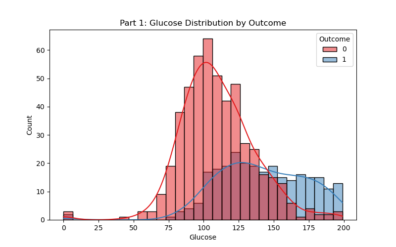
*Part 1: Glucose Distribution by Outcome*

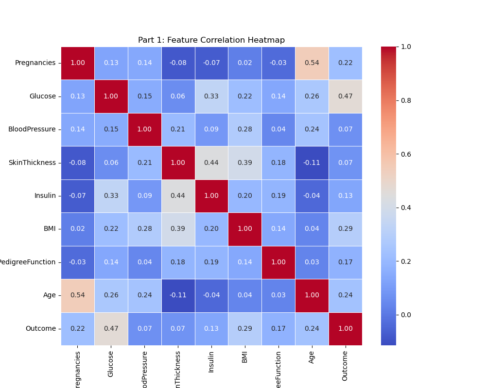
*Part 1: Feature Correlation Heatmap*

## Part 2: Data Preprocessing
### 1. Handling Missing Data
If we just deleted every row that had a zero in columns like Insulin or SkinThickness, we would lose way too much data. Instead, we used **Median Imputation**. We temporarily turned all those impossible zeroes into NaNs and then filled them in with the median value of their specific columns. We went with the median instead of the mean because it doesn't get skewed by extreme outliers.

### 2. Feature Scaling
Since KNN relies on measuring physical distances between data points, leaving the data unscaled would be a disaster. Huge numbers (like Glucose) would completely drown out features with smaller numbers. To level the playing field, we used **Min-Max Normalization** to force all values into a standard scale between 0.0 and 1.0.

### 3. Before & After Preprocessing Summary
Here is how the data looked before and after we cleaned it up:

| Feature | Original Median (With Zeros) | Corrected Median (Zeros Removed) | Scaled Range (Min-Max) |
| :--- | :--- | :--- | :--- |
| **Glucose** | 117.0 | 117.0 | 0.0 to 1.0 |
| **BloodPressure** | 72.0 | 72.0 | 0.0 to 1.0 |
| **SkinThickness** | 23.0 | 29.0 | 0.0 to 1.0 |
| **Insulin** | 30.5 | 125.0 | 0.0 to 1.0 |
| **BMI** | 32.0 | 32.3 | 0.0 to 1.0 |

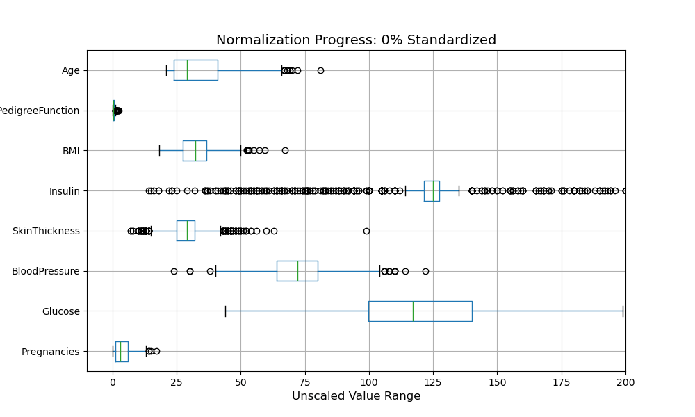
*Part 2: Normalization Progress: Unscaled to Standardized*

## Part 3: KNN Implementation & Manual Computation
We split the dataset into 80% Training and 20% Testing. Just to prove we know how the algorithm actually does its job, we manually computed the distances for a single test instance against the first ten training samples.

The standardized feature vector order is: `[Pregnancies, Glucose, BloodPressure, SkinThickness, Insulin, BMI, DiabetesPedigreeFunction, Age]`.

**Target Test Instance (Scaled):**
`x = [0.353, 0.348, 0.347, 0.283, 0.212, 0.323, 0.150, 0.367]`

We used the **Euclidean Distance** formula:
`d = √[ Σ(x - y)² ]`

**Manual Computation Summary Table:**

| Training Sample | Exact Mathematical Expansion: √[ Σ(x - y)² ] | Final Distance (d) | Actual Outcome |
| :--- | :--- | :--- | :--- |
| **Training Sample 1** | √[ (0.353-0.118)² + (0.348-0.258)² + (0.347-0.490)² + (0.283-0.239)² + (0.212-0.133)² + (0.323-0.288)² + (0.150-0.096)² + (0.367-0.000)² ] = √0.2305 | 0.4801 | 0 (Healthy) |
| **Training Sample 2** | √[ (0.353-0.529)² + (0.348-0.439)² + (0.347-0.592)² + (0.283-0.185)² + (0.212-0.133)² + (0.323-0.204)² + (0.150-0.514)² + (0.367-0.483)² ] = √0.2750 | 0.5244 | 1 (Diabetic) |
| **Training Sample 3** | √[ (0.353-0.059)² + (0.348-0.613)² + (0.347-0.224)² + (0.283-0.130)² + (0.212-0.083)² + (0.323-0.215)² + (0.150-0.246)² + (0.367-0.017)² ] = √0.3545 | 0.5954 | 0 (Healthy) |
| **Training Sample 4** | √[ (0.353-0.000)² + (0.348-0.755)² + (0.347-0.265)² + (0.283-0.239)² + (0.212-0.133)² + (0.323-0.076)² + (0.150-0.075)² + (0.367-0.733)² ] = √0.5058 | 0.7112 | 0 (Healthy) |
| **Training Sample 5** | √[ (0.353-0.353)² + (0.348-0.581)² + (0.347-0.571)² + (0.283-0.326)² + (0.212-0.428)² + (0.323-0.573)² + (0.150-0.068)² + (0.367-0.417)² ] = √0.2245 | 0.4738 | 1 (Diabetic) |
| **Training Sample 6** | √[ (0.353-0.059)² + (0.348-0.555)² + (0.347-0.469)² + (0.283-0.065)² + (0.212-0.109)² + (0.323-0.157)² + (0.150-0.168)² + (0.367-0.017)² ] = √0.3521 | 0.5934 | 0 (Healthy) |
| **Training Sample 7** | √[ (0.353-0.235)² + (0.348-0.568)² + (0.347-0.490)² + (0.283-0.239)² + (0.212-0.133)² + (0.323-0.301)² + (0.150-0.096)² + (0.367-0.033)² ] = √0.2049 | 0.4527 | 1 (Diabetic) |
| **Training Sample 8** | √[ (0.353-0.588)² + (0.348-0.755)² + (0.347-0.449)² + (0.283-0.174)² + (0.212-0.142)² + (0.323-0.149)² + (0.150-0.106)² + (0.367-0.433)² ] = √0.2843 | 0.5332 | 1 (Diabetic) |
| **Training Sample 9** | √[ (0.353-0.059)² + (0.348-0.413)² + (0.347-0.367)² + (0.283-0.424)² + (0.212-0.197)² + (0.323-0.354)² + (0.150-0.144)² + (0.367-0.050)² ] = √0.2125 | 0.4610 | 0 (Healthy) |
| **Training Sample 10**| √[ (0.353-0.059)² + (0.348-0.232)² + (0.347-0.316)² + (0.283-0.239)² + (0.212-0.133)² + (0.323-0.018)² + (0.150-0.077)² + (0.367-0.000)² ] = √0.3416 | 0.5845 | 0 (Healthy) |

**Nearest Neighbors Classification (for K=3):**
When we sorted the distances from lowest to highest, the 3 nearest neighbors were Train 7 (Class 1), Train 9 (Class 0), and Train 5 (Class 1). Since we got two 1s and one 0, the majority vote means the model predicts **Class 1 (Diabetic)** for this specific test instance.

## Part 4: Model Evaluation & Bonus
We tested the algorithm using K=3, K=5, and K=7. Just for the bonus, we also ran Logistic Regression on the exact same data as a baseline.

| Model Type | Overall Accuracy | True Positives | False Positives | True Negatives | False Negatives |
| :--- | :--- | :--- | :--- | :--- | :--- |
| **KNN (K = 3)** | 72.08% | 35 | 23 | 76 | 20 |
| **KNN (K = 5)** | 74.68% | 36 | 20 | 79 | 19 |
| **KNN (K = 7)** | **74.68%** | 34 | 18 | 81 | 21 |
| **Logistic Regression** | 76.62% | 35 | 16 | 83 | 20 |

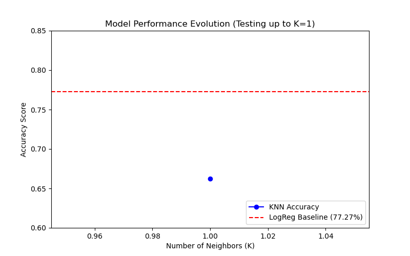
*Part 4: Model Performance Evolution*

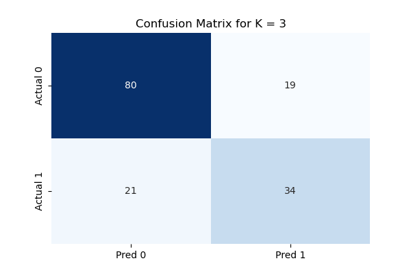
*Part 4: Confusion Matrix for K=7*

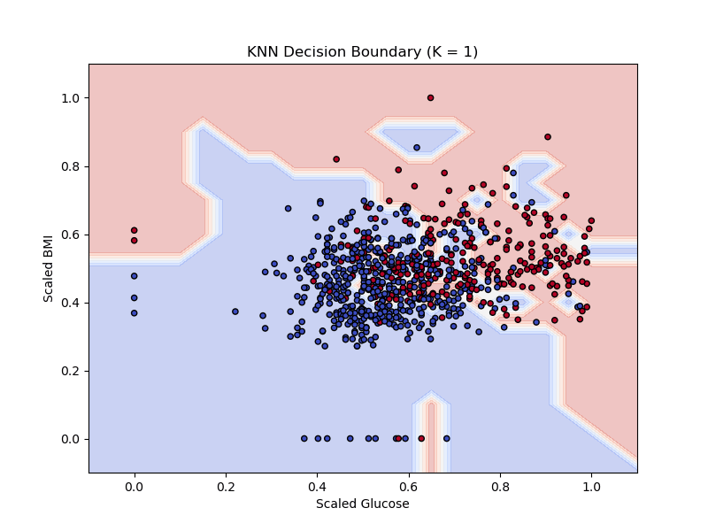
*Part 4: KNN Decision Boundary*

### Evaluation Questions:
**1. Which value of K performed best?**
Looking at the accuracy, K=5 and K=7 were tied at 74.68%. But when you check the confusion matrix, K=7 is slightly better for real-world clinical use because it had fewer false positives (only 18 healthy patients mistakenly flagged as diabetic).

**2. Why does performance change with different K values?**
The performance changes because K sets the size of the "neighborhood" voting on the outcome. Changing K literally redraws the spatial decision boundaries. A smaller K makes the boundaries super jagged as the model tries to capture every single point, while a bigger K smooths things out so the model looks at the bigger picture.

**3. What happens when K is too small or too large?**
* **Too Small (e.g., K=1):** The model completely overfits. It gets way too sensitive to random noise or weird outliers in the data.
* **Too Large (e.g., K=150):** The model underfits. The neighborhood is so big that the model just gives up on looking at local similarities and defaults to guessing whichever class has the most patients in the whole dataset.

## Part 5: Analysis and Reflection
Doing this project really showed us both the cool parts and the big flaws of instance-based machine learning.

One of the best things about KNN is how simple and interpretable it is. Since it’s a "lazy learner," it doesn't try to force the data into some rigid mathematical equation like Logistic Regression does. For medical diagnostics, this transparency is awesome. If a doctor asks *why* the algorithm diagnosed someone as diabetic, we can literally point to the specific historical patient records (the nearest neighbors) that had almost the exact same biological metrics. It works on actual logic and precedent, not just abstract probabilities.

But we also hit some pretty brutal limitations. The biggest takeaway was that KNN is insanely sensitive to data scaling. As our boxplot animations showed, if we hadn't used Min-Max normalization, the algorithm would have been useless. Unscaled data means big numbers (like Glucose) completely erase the impact of smaller but critical numbers (like the Pedigree Function). Also, the computation cost is a pain. Since it doesn't "train" an equation in advance, it has to calculate the physical distance to every single training instance every time it tries to make a new prediction.

In the end, KNN is great for smaller, properly scaled datasets where being able to explain the "why" is super important. But for massive datasets or real-time systems that need instant answers, a model like Logistic Regression (which beat our KNN model with 76.62% accuracy) is definitely the better and faster choice.

---

## Conclusion

This project successfully demonstrates the application of KNN and K-Means using both synthetic and real-world datasets.

KNN effectively classified new instances based on similarity, while K-Means revealed meaningful groupings. The extended activity reinforced the importance of preprocessing, parameter tuning, and evaluation in machine learning workflows.